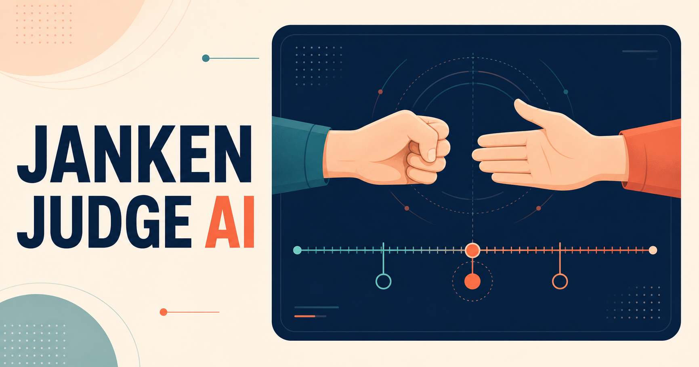

# Janken Judge AI

**カメラに映った二人の手をブラウザ内で認識し、勝敗と「どちらが先に手を確定したか」を解析するAI審判です。**

[](https://janken-judge-ai.vercel.app)
[](https://shin7303.github.io)



Next.js 16 / TypeScript による個人開発アプリです。サーバー、DB、外部推論APIを一切使わず、映像認識から判定・リプレイ・履歴までをブラウザだけで完結させています。

## この実装の見どころ

| 観点 | やったこと |
| --- | --- |
| リアルタイム画像認識 | MediaPipe TasksをWeb Workerで実行。最新1フレームだけを保持するキューと自動解像度調整でメインスレッドの詰まりを回避 |
| ロジックとUIの分離 | 勝敗・確定時刻・公平性の解析を純粋関数として`domain/`に隔離し、7種のJSON観測データで再現テスト |
| プライバシー設計 | バックエンド・API Route・認証・DBなし。映像とランドマークは送信せず、履歴は端末内のみ |
| 堅牢性 | カメラAPI・Worker・MediaRecorder・Web Audioの非対応を個別にフォールバック |
| テスト | Vitest 23ファイル（判定・追跡・状態機械・キュー・フォールバック）＋ Playwright E2E。CIで型検査・Lint・テスト・本番ビルドを実行 |
| 誠実な設計 | 信頼できない観測は無理に勝敗を出さず`INSUFFICIENT_DATA` / `INVALID_ROUND`を返す |

- インストール不要
- 映像・静止画は端末内だけで処理
- スローリプレイと判定タイムライン
- 両手が準備できると自動でカウントダウン開始

## 30秒で分かる概要

一台のカメラに二人の手を映すと、MediaPipeが連続フレームからグー・チョキ・パーを推定します。アプリは「PON」を基準に、各プレイヤーの手が安定した推定時刻、時刻差、確定後の変更を純粋関数で解析します。結果は勝敗だけでなく理由コード、品質、リプレイ、タイムラインとして提示します。「不正」や意図を断定する用途ではありません。

最初にカメラを許可し、左右の枠に一人ずつ手を入れるだけで準備完了後にカウントダウンを始めます。感度、音量、自動開始、リプレイ、左右反転は `/settings` にまとめています。

## 主要機能

- 二つの手の同時認識と位置・軌跡に基づくPlayer A/B割り当て
- カウントダウン、PON、観測、結果までの中断可能な状態機械
- 安定区間、確定時刻差、確定後変更、公平性ヒューリスティックの解析
- Worker推論、最新一件だけを保持するフレームキュー、自動解像度調整
- 0.25×・0.5×・1×の端末内リプレイと根拠タイムライン
- 端末内だけに保存する直近20件の履歴とJSON書き出し
- 感度、録画、左右反転、カウントダウン音量、自動開始のローカル設定
- スマートフォンの一画面に収まるライブプレイ表示と、設定へ分離した詳細項目
- カメラAPI・Worker・MediaRecorder・Web Audioの非対応フォールバック

## 技術スタック

- Next.js 16 / React 19 / TypeScript
- MediaPipe Tasks Vision（モデルとWASMをセルフホスト）
- Web Worker / MediaStream / MediaRecorder / Canvas / Web Audio
- Vitest / Testing Library / Playwright
- ESLint / Prettier / GitHub Actions
- Vercel Hobbyを想定した静的・クライアント完結構成

## アーキテクチャ

```text
Camera ── ImageBitmap ──> MediaPipe Worker
  │                         │ newest-frame queue
  │                         ▼
  └── local replay     normalized observations
                            │
                 pure tracking / round analysis
                            │
              result / timeline / local history
```

バックエンド、API Route、認証、データベース、外部推論APIはありません。映像、静止画、ランドマーク列はネットワークへ送信せず、録画Blobもセッション中のObject URLとしてのみ保持します。詳細は[Architecture](docs/architecture.md)と[ADR](docs/adr/0001-client-only-worker-inference.md)を参照してください。

## 後出し可能性の判定

各プレイヤーについて、同じ有効ジェスチャーが設定時間・設定サンプル数だけ続く最初の区間を「確定」とします。PONに対する確定時刻、両者の差、遅い側の勝敗上の有利さ、確定後に別の手が安定したかを組み合わせ、`CLEAR`、`DELAYED`、`REVIEW`、`LIKELY_LATE`、`SWITCH_DETECTED`へ分類します。

手の欠損、低信頼度、低FPS、交差、曖昧な割り当てでは `INSUFFICIENT_DATA` または `INVALID_ROUND` を優先します。閾値は[domain/round-config.ts](domain/round-config.ts)に集約しています。この判定は科学的な不正検出ではなく、映像上の時刻差を楽しむためのヒューリスティックです。

## プライバシー

- カメラはボタン操作後にだけ要求し、マイク権限は要求しません。
- 推論、明るさサンプル、録画、結果生成はブラウザ内で完結します。
- ページ離脱、停止、切断時にMediaStream、Worker、ImageBitmap、Object URLを破棄します。
- 履歴と設定はlocalStorage、直前の結果とリプレイはsessionStorageに限定します。
- 顔認識、クラウド動画保存、外部分析サービスは使用しません。

## ローカル起動

Node.js 22とCorepackを使用します。

```bash
corepack enable
corepack pnpm install --frozen-lockfile
corepack pnpm dev
```

`http://localhost:3000` を開きます。カメラの使用はプレイ画面の明示的なボタン操作後にのみ要求されます。

## テスト

```bash
corepack pnpm format:check
corepack pnpm lint
corepack pnpm typecheck
corepack pnpm test
corepack pnpm exec playwright install chromium
corepack pnpm test:e2e
corepack pnpm build
```

ユニットテストは判定、追跡、状態機械、キュー、設定、自動開始、ブラウザAPIのフォールバックを対象にします。統合テストは7種類のJSON観測データを本番解析関数へ通します。E2Eはプレイ導線、履歴、設定、モバイル一画面表示、カメラのWorker境界を検証します。実カメラとMediaPipeの精度は実機確認が別途必要です。

## Vercelデプロイ

1. このリポジトリをGitHubへpushします。
2. VercelでリポジトリをImportします。
3. Framework PresetはNext.js、Install/Build Commandは既定値を使用します。
4. 環境変数、データベース、外部サービスは追加しません。
5. Production Deploy後、HTTPS上でカメラ、Worker、WASM、レスポンスヘッダーを実機確認します。
6. 公開URLとREADMEのリンクが一致することを確認します。

モデルとWASMにはimmutableキャッシュを、全ページにはカメラ・マイク、MIME sniffing、Referrerのセキュリティヘッダーを設定済みです。

## 既知の限界

- 一般的な一台のカメラでは、相手の手を実際に見た時刻や意図は測定できません。
- 確定時刻は画像認識上の推定値で、FPS、露光、遅延、端末性能に左右されます。
- モーションブラー、指の重なり、照明、背景、手袋、肌とのコントラストで精度が変わります。
- PON前から映るグーと、PONで出したグーは区別しにくい場合があります。
- 手の交差や三本以上の手は追跡が曖昧になるため判定を保留します。
- MediaPipeの既定モデルはじゃんけん専用に学習されたものではありません。
- Safariを含む実機差によりWorker、録画形式、音声のフォールバックが使われる場合があります。
- 公式競技、紛争解決、不正の断定には使用できません。

詳細は[Known limitations](docs/limitations.md)を参照してください。

## Codexを使った開発

[Specification](docs/specification.md)を要件の唯一の情報源、`AGENTS.md`を実装規律として、機能を独立検証可能な小さなコミットへ分割しました。各段階でlint、型、ユニット、E2E、production buildを実行し、失敗と修正を[AI development log](docs/ai-development-log.md)へ記録しています。公平性ロジックをReactから分離し、JSON fixtureで再現できることをAI生成コードのガードレールにしています。

## ライセンス

現時点ではライセンスを付与していません。再利用条件を定めるライセンスは公開前にリポジトリ所有者が選定します。

## 今後の改善

1. 複数実機・照明条件での閾値キャリブレーション
2. 同意を得た評価用じゃんけん映像データセット
3. じゃんけん専用分類器と速度ベースの確定時刻推定
4. 手首・指先の速度グラフとアクセシブルな代替表示
5. 実機CIまたは定期的なブラウザ互換性検証

## ドキュメント

- [Detailed specification](docs/specification.md)
- [Architecture](docs/architecture.md)
- [Architecture Decision Records](docs/adr/0001-client-only-worker-inference.md)
- [Known limitations](docs/limitations.md)
- [AI development log](docs/ai-development-log.md)
